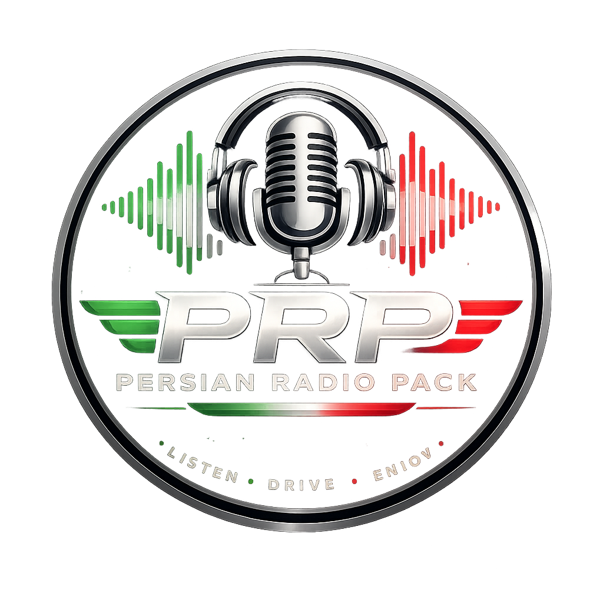

# Persian Radio Manager

### Easy Persian Radio Management for
### Euro Truck Simulator 2 & American Truck Simulator

[🇮🇷 Read this page in Persian](README_FA.md)

---

## 🎙 About

**Persian Radio Manager** is a free and open-source application designed to make installing, updating, backing up, and managing **Persian Radio Pack** for **Euro Truck Simulator 2 (ETS2)** and **American Truck Simulator (ATS)** simple and automatic.

The goal of this project is to allow users to install and manage Persian radio stations with only a few clicks without manually editing game files.

---

# ✨ Features

- ✅ Automatic ETS2 detection
- ✅ Automatic ATS detection
- ✅ One-click Persian Radio Pack installation
- ✅ Download latest radio pack from GitHub
- ✅ Version checking and update system
- ✅ Automatic backup before installation
- ✅ Restore previous backups
- ✅ Separate support for ETS2 and ATS
- ✅ Modern graphical interface using CustomTkinter
- ✅ Lightweight and easy to use
- ✅ Free and open-source

---

# 🖥 Screenshots

Application screenshots are available here:

